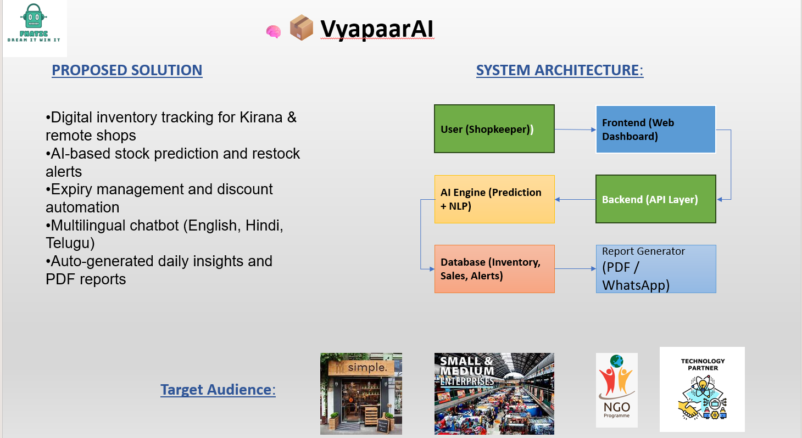
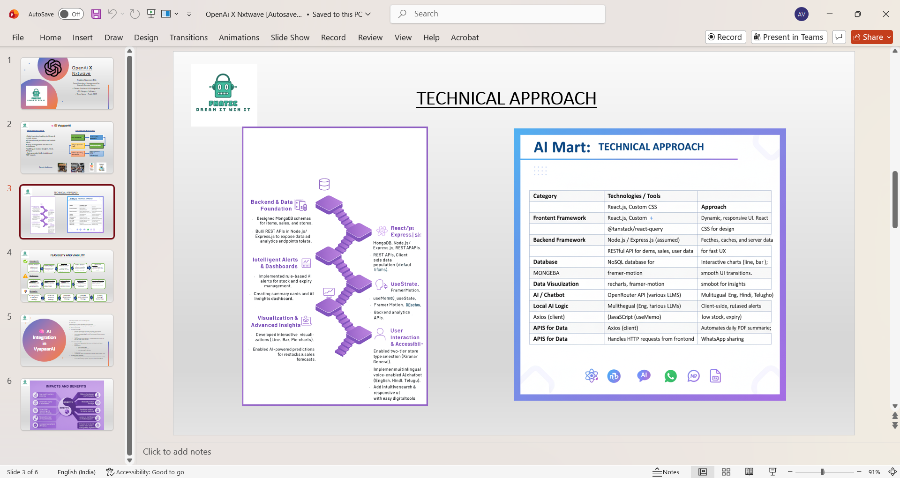
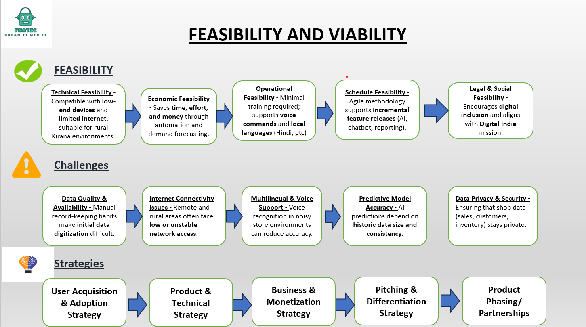
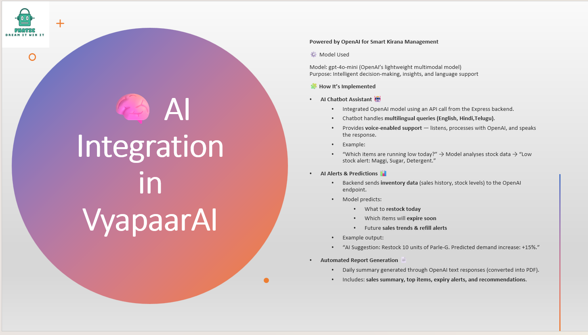

README for Backend (statelevel_backend — Server)

📌 Repo: https://github.com/Theju1212/statelevel_backend

VyapaarAI — Backend (Node + Express + MongoDB)

AI-powered backend that handles prediction, multilingual chatbot, expiry alerts, restock alerts, and PDF report generation.

This backend exposes REST APIs for the React frontend and integrates with AI models for insights & automation.

🧠 Core Features
✔ AI Chatbot Engine

Supports English, Hindi, Telugu, responds to product queries, restocking advice, store FAQs.

✔ AI Predictions

What to restock today

Items that will expire soon

Sales trends

Refill alerts

✔ Automated PDF Reports

Backend generates daily summary PDFs including:

Sales summary

Stock alerts

Expiry alerts

AI recommendations

✔ Inventory, Sales, Alerts APIs

CRUD APIs for store items, stock updates, alerts, etc.

🛠️ Tech Stack
Layer	Technologies
Runtime	Node.js
Web Framework	Express.js
Database	MongoDB
AI Engine	OpenAI / LLM API Integration
PDF Reports	pdf-lib / html-pdf / puppeteer (depending on your code)
Authentication	JWT
📁 Project Structure
statelevel_backend/
│── config/
│── controllers/
│── models/
│── routes/
│── middleware/
│── utils/
│── server.js
└── package.json

⚙️ Environment Variables

Create .env based on this template:

PORT=5000
MONGODB_URI=
JWT_SECRET=

OPENAI_API_KEY=
CLIENT_URL=http://localhost:5173

🚨 Never commit real API keys or passwords.

🚀 Setup Instructions
1️⃣ Install dependencies
npm install

2️⃣ Start backend
npm run start

Server runs at:

http://localhost:5000

🔗 API Routes Overview
Route Type	Example
Auth	/api/auth/register, /login
Items	/api/items, /api/items/:id
Alerts	/api/alerts/expiry, /alerts/stock
Chatbot	/api/ai/chat
Predictions	/api/ai/predict
Reports	/api/report/daily
🤖 AI Engine Architecture

Backend handles all LLM-powered tasks:

Request → Preprocessing

Inventory DB fetch

Context building

LLM call (OpenAI)

Post-processing

Response

This keeps all intelligence centralized, clean, and fast.

🧪 Testing

Use Postman / ThunderClient collection:

/docs/api-testing/

Add screenshots of working API results if needed.

📄 Screenshots & Architecture
## 📸 Screenshots

### Architecture

### Technical Approach

### Feasibility & Viability

### AI Integration

### Impacts & Benefits

📌 License

MIT License.